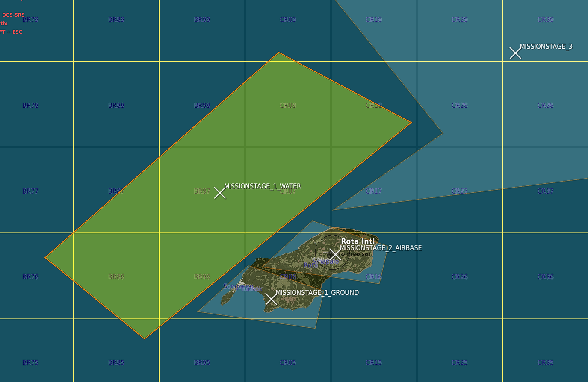
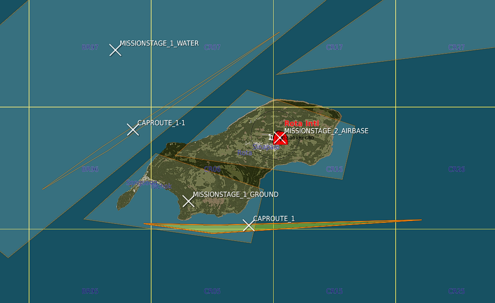

# Spearhead

## Get Started

This guide is to get you started building your first Spearhead mission.  
Spearhead was created to enable the mission maker to worry as little about the running, timing and scripting and most about the setting and looks and feel of the mission.  

In the example we'll show how you can create a simple island hopping mission 

## Include Script

Firstly include the script. 
<a download="spearhead.lua" href="./spearhead.lua" target="_blank" rel="noopener noreferrer">Download Script</a>

## Stages

So first of all think about the stages. Read the details about them here: [Stages](./Reference.html#stage) 
These are logically ordered zones that will activate one by one based on the mission status in them.  
There is a little more to it, but you'll find out.  

Stages need to be named according to the convention: `MISSIONSTAGE_<OrderNumber>_<FreeForm>`  
The first stage will be called `MISSIONSTAGE_1` or `MISSIONSTAGE_1_EAST` for example.  

For this mission we started with the three stages: `MISSIONSTAGE_1_GROUND`, `MISSIONSTAGE_1_WATER` and `MISSIONSTAGE_2_AIRBASE` as you see in the image.  

In this example `_GROUND` and `_WATER` stages will be actived at the start of the mission.  
`_AIRBASE` will however not be activated since the order number is 2  
`MISSIONSTAGE_3` will be used as part of this example as well. It's a stage even further away.  

## Setting up CAP

If you don't want to use the CAP managers withing Spearhead you can skip this and continue to [setting up the missions](#setting-up-the-missions).  
However CAP is one of the painpoints in a lot of missions and setting up a dynamic feeling airspace can be quite the challenge.  
With the CAP managers we've tried to make this a lot easier.  

A CAP group needs to follow the following naming convention: `CAP_<A|B><CONFIG>_<Free Form>`

For details on config read this: [CAP Group Config](./Reference.html#cap-group-config)
 
For now I set up 3 groups with the following names. `CAP_A[1]1_Rota1` , `CAP_A[1]1_Rota1-1` , `CAP_B[1]1_Rota1`  
The first two are marked with `A` and will therefore be primary CAP units. They will be scheduled and make up for the total count.  
Meaning that for this airbase there is 2 CAP units max at a time flying out.  
In this case all groups have `[1]1` in the name, (This would be the same as `[1]A`) which means that when stage 1 is active the groups will activate and fly out to stage 1.

I also set up a few groups further back. One example: `CAP_A[1-3]3_Group1`. This group will protect zone 3 when zones 1 through 3 are active. 

CAP units fly out, fly their CAP zone for x amount of minutes and will then RTB.  
Before they actually RTB an event is triggered 10 minutes before the actual RTB task. This event will trigger a backup unit to startup and fly out to take over.  

Best is to test it out and see for yourself.  

### Creating CAP routes

Creating cap routes is not needed per se, but with a multi-stage stage (we have 2 stages with `_1_`) it is recommended.  
Similarly with huge stages.  
If there is multiple zones is will "round-robin" over them.  

If no CAP route is present the unit will fly a route generated differently per zone:  
`quad zone` => race-track between the corner closest to the origin airbase to the center point of the zone  
`circle zone` => race-track between the closest point on circle to the origin airbase to the center  

If you want to create you own CAP Routes you can!  
For this example I created 2 CAP routes inside of the 2 `_1_` stages.  

As you can see below there's a nice feature you can exploit. As long as the `X` of the zone is inside of the the `CAPROUTE` will be used for that stage! 

Now all you need to do is start the mission (single player works just fine) and see the AI fly around.  
Tip: Speeding up the simulation speed to 10x or 15x can help you see how the AI will fly and how it will behave.  

Well, nice, we're don setting up the initial CAP effort.  
If you want to change values for the CAP routes please read about how to configure it here: [Cap Config](./Reference.html#cap-config)

## Setting up the Missions

