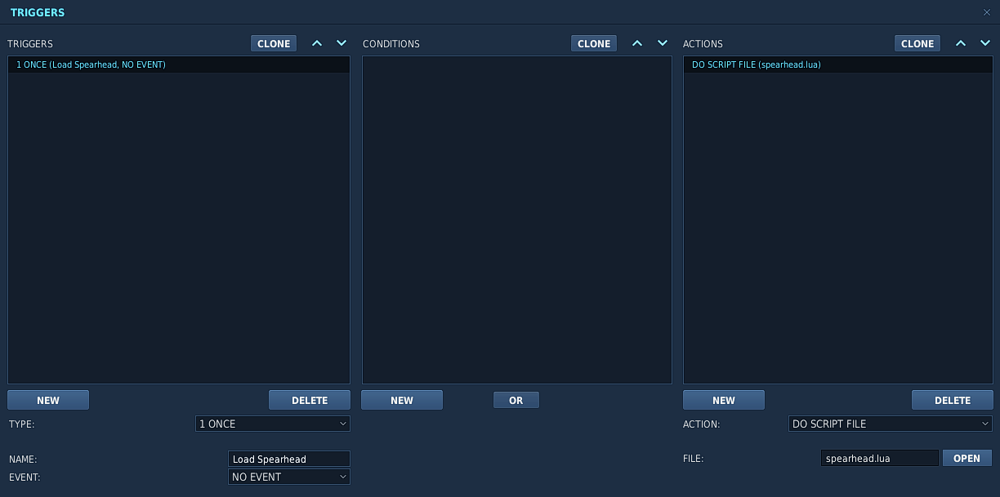
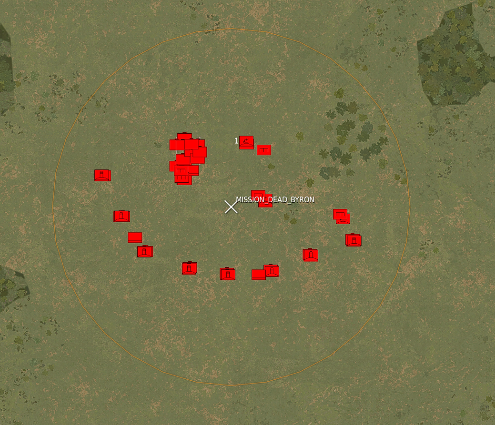
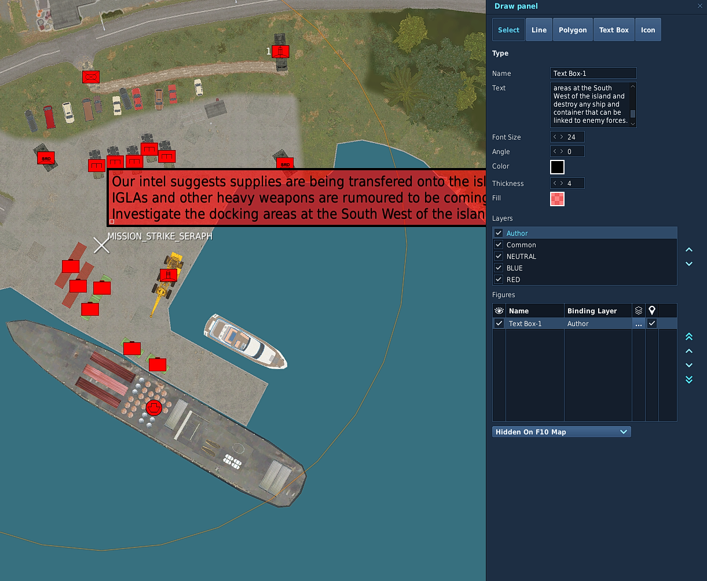
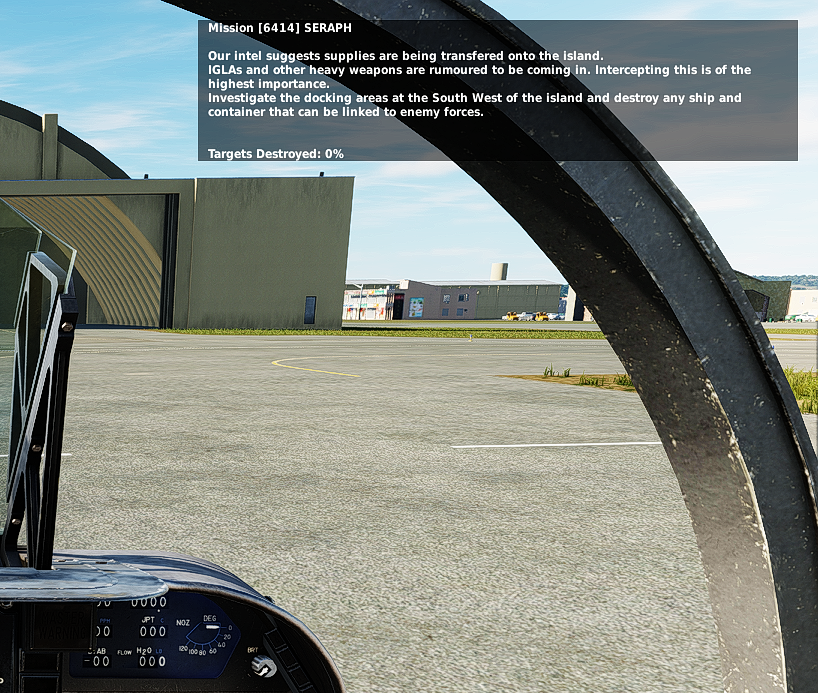

# Spearhead


## Get Started

This guide is to get you started building your first Spearhead mission. <br/>
Spearhead was created to enable the mission maker to worry as little about the running, timing and scripting and most about the setting and looks and feel of the mission. <br/>

In the example we'll show how you can create a simple island hopping mission 

## Include Script

Firstly include the script. 
<a download="spearhead.lua" href="./spearhead.lua" target="_blank" rel="noopener noreferrer">Download Script</a>

Then run the script in the mission. <br/>
Please do exactly as it's done below. <br/>



> Spearhead does not require any dependencies (eg. MIST or MOOSE). Compatibility with other frameworks is not tested at this time, so cannot be guaranteed, but there should be no conflicts if they are not controlling the same units. 

## Stages

So first of all think about the stages. Read the details about them here: [Stages](./Reference.html#stage)<br/>
These are logically ordered zones that will activate one by one based on the mission status in them. <br/>
There is a little more to it, but you'll find out. <br/>

Stages need to be named according to the convention: `MISSIONSTAGE_<OrderNumber>_<FreeForm>` <br/>
The first stage will be called `MISSIONSTAGE_1` or `MISSIONSTAGE_1_EAST` for example. <br/>

For this mission we started with the three stages: `MISSIONSTAGE_1_GROUND`, `MISSIONSTAGE_1_WATER` and `MISSIONSTAGE_2_AIRBASE` as you see in the image. <br/>


In this example `_GROUND` and `_WATER` stages will be actived at the start of the mission. <br/>
`_AIRBASE` will however not be activated since the order number is 2 <br/>
`MISSIONSTAGE_3` will be used as part of this example as well. It's a stage even further away. <br/>


## Setting up CAP

If you don't want to use the CAP managers withing Spearhead you can skip this and continue to [setting up the missions](#setting-up-the-missions). <br/>
However CAP is one of the painpoints in a lot of missions and setting up a dynamic feeling airspace can be quite the challenge. <br/>
With the CAP managers we've tried to make this a lot easier. <br/>

A CAP group needs to follow the following naming convention: `CAP_<A|B><CONFIG>_<Free Form>`

For details on config read this: [CAP Group Config](./Reference.html#cap-group-config)
 
For now I set up 3 groups with the following names. `CAP_A[1]1_Rota1` , `CAP_A[1]1_Rota1-1` , `CAP_B[1]1_Rota1` <br/>
The first two are marked with `A` and will therefore be primary CAP units. They will be scheduled and make up for the total count. <br/>
Meaning that for this airbase there is 2 CAP units max at a time flying out. <br/>
In this case all groups have `[1]1` in the name, (This would be the same as `[1]A`) which means that when stage 1 is active the groups will activate and fly out to stage 1.

I also set up a few groups further back. One example: `CAP_A[1-3]3_Group1`. This group will protect zone 3 when zones 1 through 3 are active. 

CAP units fly out, fly their CAP zone for x amount of minutes and will then RTB. <br/>
Before they actually RTB an event is triggered 10 minutes before the actual RTB task. This event will trigger a backup unit to startup and fly out to take over. <br/>

Best is to test it out and see for yourself. <br/>

### Creating CAP routes

Creating cap routes is not needed per se, but with a multi-stage stage (we have 2 stages with `_1_`) it is recommended. <br/>
Similarly with huge stages. <br/>
If there is multiple zones is will "round-robin" over them. <br/>

If no CAP route is present the unit will fly a route generated differently per zone: <br/>
`quad zone` => race-track between the corner closest to the origin airbase to the center point of the zone <br/>
`circle zone` => race-track between the closest point on circle to the origin airbase to the center <br/>

If you want to create you own CAP Routes you can! <br/>
For this example I created 2 CAP routes inside of the 2 `_1_` stages. <br/>

As you can see below there's a nice feature you can exploit. As long as the `X` of the zone is inside of the the `CAPROUTE` will be used for that stage! 


Now all you need to do is start the mission (single player works just fine) and see the AI fly around. <br/>
Tip: Speeding up the simulation speed to 10x or 15x can help you see how the AI will fly and how it will behave. <br/>

Well, nice, we're don setting up the initial CAP effort. <br/>
If you want to change values for the CAP routes please read about how to configure it here: [Cap Config](./Reference.html#cap-config)


> **_NOTE:_**  Stages that have CAP units active on their airbases will have all Airbase units and `SAM` missions activated. This is to give the possibility to protect the enemy CAP units

## Setting up the Missions

Now the part where you as a mission maker can really get into the nitty gritty. <br/>
Missions are managed and monitored by Spearhead. <br/>
Statics, groups and single units all alike. <br/>

> **_NOTE:_** While static are the same as groups in this context, they are not within DCS, please refrain from using static groups. A `static` in DCS has a 1:1 relation for group:unit 

For this example I'll set up two missions. The first one is `DEAD` mission and will consist of an SA-2 site with an additional "control center". 

#### Mission 1: DEAD

As you can see on the left image the template of the SA-2 was placed. Then dragged around to only fce south. <br/>
An additional track radar and search radar was added and all launchers were surrounded by sandbags. <br/>
On top of this there was a sort of control center added with walls, vehicles and some tents. 

On the right you can see the end result. Which is a very nice SA-2 site with static units spawned. <br/>

<div style="display: flex">
    <div style = "flex: 50%">
        
    </div>
     <div style = "flex: 50%">
        
    </div>
</div>

Important to note. It's all inside the triggerzone `MISSION_DEAD_BYRON`. Which means it's a `MISSION` of type `DEAD` and with name `BYRON`. <br/>
At the start Spearhead will detect the triggerzone, take all units and despawn them and only spawn when needed for better performance. <br/>

The current list of mission types are: 
```
DEAD
BAI
STRIKE

SAM -- Special type that will also activate on "pre-activated stages" 
```

Each type has some additional completion logic to it. <br/>
`DEAD` and `SAM` missions will be marked complete when all air defences are destroyed. This includes Tracking Radars, Self tracking launchers and AAA guns if they are inside the zone. <br/>
If you want to add the Search radar or another random unit like the command tent to the target list you can add a `TGT_` prefix to the unit or group you want destroyed. <br/>
Please be aware that adding `TGT_` to a group will make the entire group a target and therefore each unit needs to be destroyed. <br/>

#### Mission 2: STRIKE

To show the power of `TGT_` targets I'll create a strike mission next. 
 
A nice supply strike mission will do. Add a ship, some containers and some additional units. <br/>
Even some SHORADS to spice the whole thing up. <br/>
In the picture below all units that are selected and who show up as white (they are actually red) have the prefix `TGT_` in front of their name. <br/>

This will make it so the mission will be marked as complete when those units are destroyed. The rest of the units will exist until the entire stage is cleaned up. <br/>

<br/>

## Mission Briefings

So now we've created some missions we also want to add briefings to them. This is pretty easy with Spearhead. <br/>

To do so click on `draw` on the left hand pane in the mission editor. This opens up the drawing tools in the editor. <br/>
On the right click `TextBox` and click somewhere inside the zone to which you want to add the briefing. <br/>
Give the briefing a name (It's not used, but can be nice to use to reference the briefing later) and add the briefing. <br/>
The text box is quite small, but can have a lot of text. Easiest is to edit the text in an editor of choice and paste it into the box afterwards. <br/>

Keep the binding layer to "Author" only. That way it doesn't show up for anyone other than in the mission editor. 

See the two images below. The left shows the `Text Box` drawing. The right shows the briefing as shown in the mission.

> **_TIP:_** You can make both the `Color` and `Fill` have a `0` value for `a`. This will make the weird box be invisible. Make sure to add the name of the mission to the text box name to easily find it back.   

<div style="display: flex">
    <div style = "flex: 50%">
        
    </div>
     <div style = "flex: 50%">
        
    </div>
</div>


## Airbase and Miscelaneous units.

You don't have to place units inside of mission zones only. Misc units and Airbase units are also managed. <br/>
But use these smartly as they can add up very quickly. <br/>
As with the other zones, static units are just as supported as normal groups.

### Airbase units

On top of `SAM` units that get activated when CAP bases are activated in a zone the airbase itself also gets activated. <br/>
All units inside of the ring (about 6600m) around the airfield will be registered as Airbase units. <br/>

### Misc units

All units in a `Stage` zone that are not in an `Airbase` will be registered as miscelaneous units. <br/>
These will be activated the moment a stage gets "Active". (Not pre-activated) <br/>
It can be friendly forces driving around. A FARP with surrounding units and tents. 

## Airbases, Farps and Carriers 

On top of units and missions, airbases, farps and carriers are big parts of a mission. 

### Airbases

Airbases are very important in a flying simulator. Not less so in missions. <br/>
Spearhead will be able to manage Airbases for you by activating/deactivating and changing it's coalition while stages are completed. <br/>

Ofcourse you don't want all bases to be flipped. So the behaviour is based on the starting coalition. <br/>

Neutral  &emsp;=> Will stay neutral the entire mission. <br/>
BLUE &emsp;&emsp; => Will turn RED when the stage is red and will turn BLUE when captured <br/>
RED  &emsp;&emsp;&emsp;=> Will stay RED and when the stage is captured it will turn NEUTRAL <br/>

#### Airbase Units

Units on these airbases are also managed. This gives a very nice opportunity to create dynamic airbases that have a true RED/BLUE feeling. <br/>
For this example we've setup Kutaisi as a "capturable" Airbase. See the image below (left)<br/>
As you can see there's a mix and match of RED and BLUE units. Luckily the framework makes sure those cannot be spawned at the same time. <br/>
On the image on the right you can see the setup of a little loading/unloading ramp. The Neutral objects will be spawned at the start and will be untouched. <br/>
On the two images below that you can see the before and after of that loading doc after the stage was taken. <br/>

Of course all other blue units will also be spawned. <br/>
This way you can have a blue SAM site, EWR, some blue static aircraft scattered around and the correct refueling and rearming trucks. <br/>
This hopefully will make the Airbases feel less desolate on longer campaigns. <br/>

<div style="display: flex">
    <div style = "flex: 50%">
        
    </div>
     <div style = "flex: 50%">
        
    </div>
</div>
<div style="display: flex">
    <div style = "flex: 50%">
        
    </div>
     <div style = "flex: 50%">
        
    </div>
</div>


### Carriers

Aircraft carriers and fleets are very nice, but what use have they if they won't move along with the front line? <br/>
For a carrier fleet to be managed it needs to abide to the name `CARRIERGROUP_<name>_<freeform>` <br/>
For example, we have a single carrier here with the groupname: `CARRIERGROUP_ALPHA_fleet` <br/>
To let the framework know where you want the carrier to be at which stages of the mission you can create `CARRIERROUTE_<name>_[<number>-<number>]_<freeform>` zones. <br/>
In the image below we have 2 zones. `CARRIERROUTE_ALPHA_[1-2]_ROUTE` and `CARRIERROUTE_ALPHA_[3-4]_ROUTE`. <br/>
This tells the framework where carriergroup `ALPHA` should go so you can have multiple smaller subfleets. <br/>


### Farps

Farp logic is in the works, but still needs some refinement. 